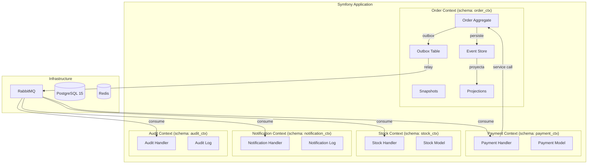
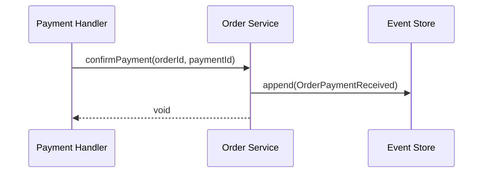
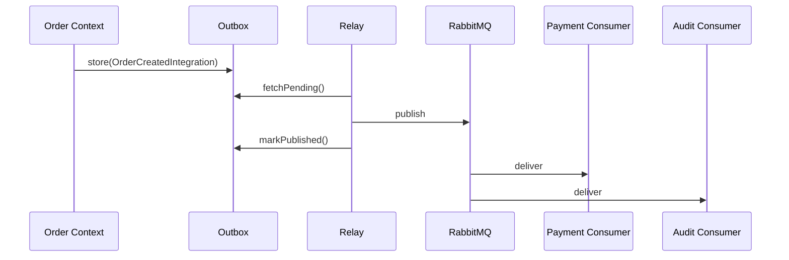
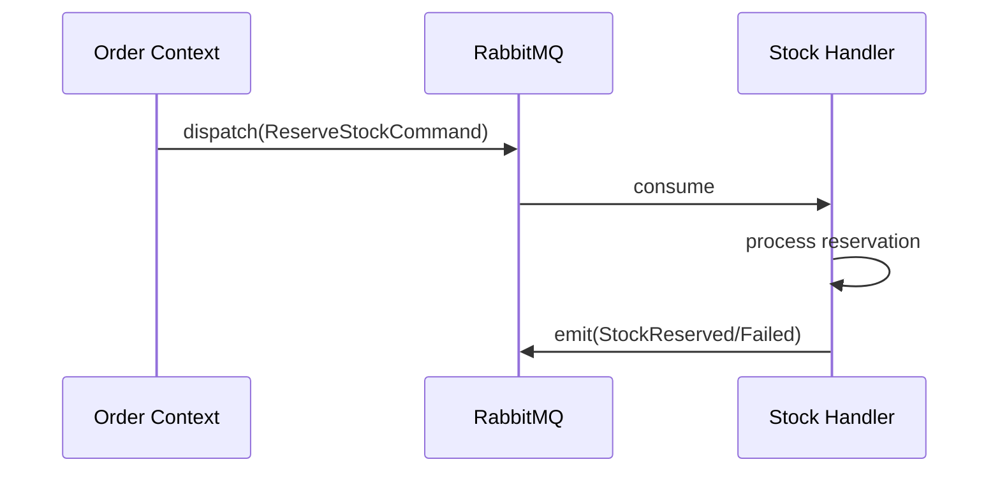
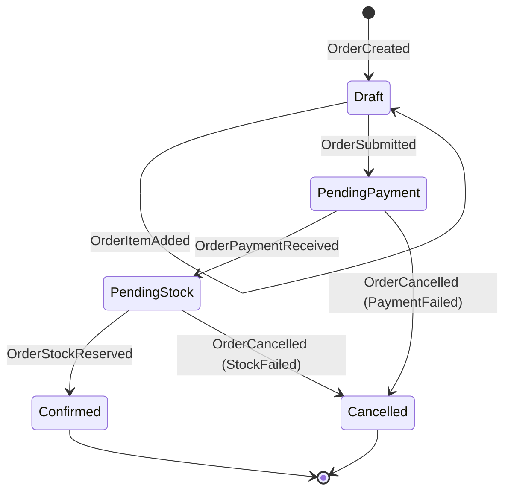
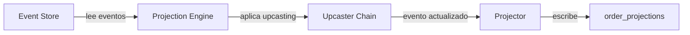
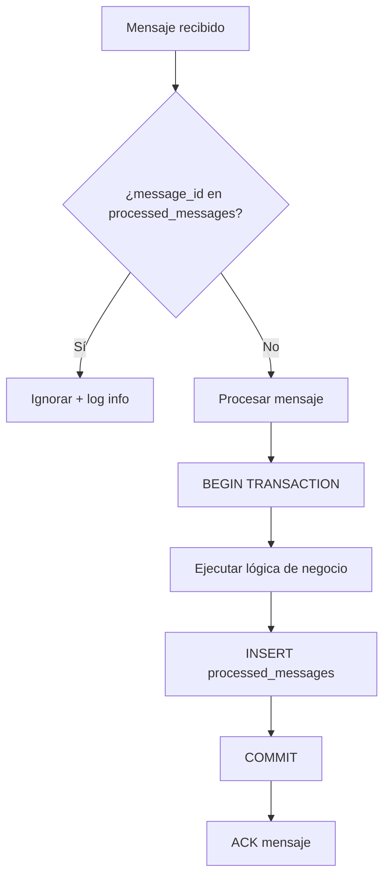
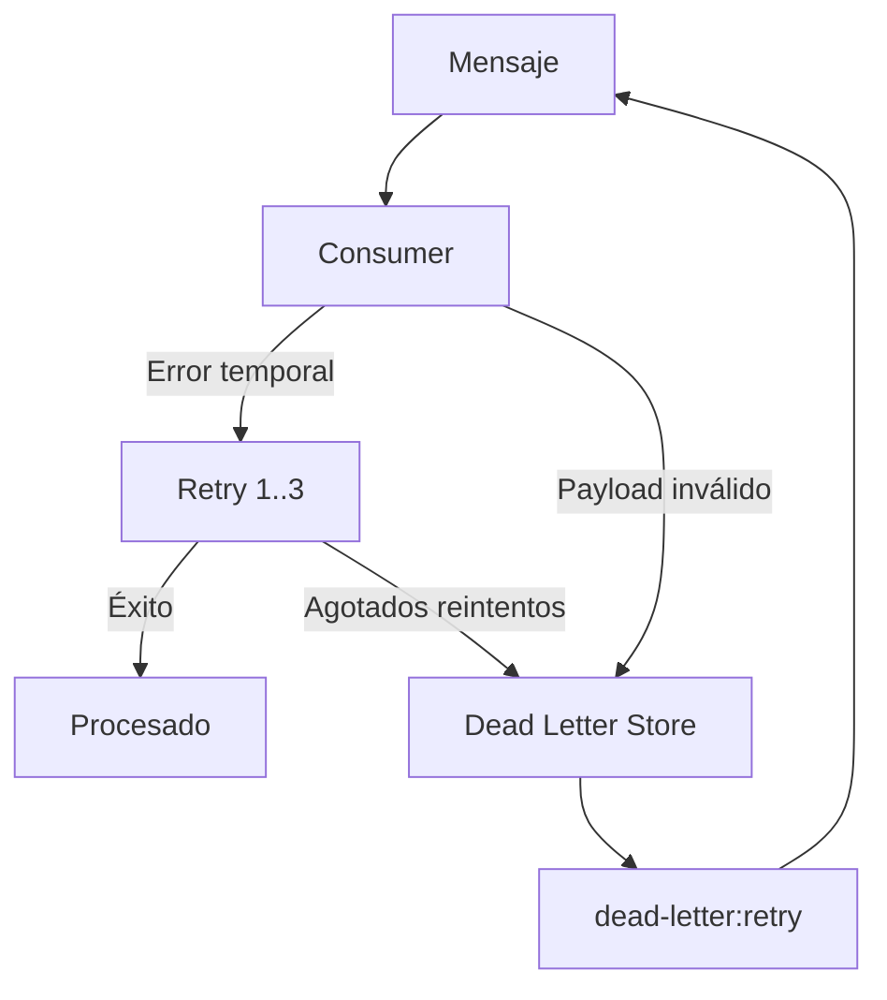

# Documento de Diseño — Event Sourcing Lab

## Resumen (Overview)

Este documento describe el diseño técnico del Event Sourcing Lab: un laboratorio didáctico construido sobre un microservicio Symfony 6.4 existente. El sistema implementa Event Sourcing completo para un dominio de Pedidos (Orders) dividido en cinco Bounded Contexts que se comunican mediante distintos patrones de mensajería.

### Objetivos del Diseño

1. **Event Store con DBAL puro** — Los eventos no son entidades Doctrine; se persisten mediante Doctrine DBAL directamente.
2. **Separación por PostgreSQL schemas** — Cada Bounded Context opera en su propio schema PostgreSQL para demostrar aislamiento lógico.
3. **Reutilización del stack** — Se aprovechan los buses de somnambulist/domain, Symfony Messenger con AMQP, y la estructura de carpetas existente.
4. **Cinco patrones de comunicación** — Service call síncrono, eventos de integración vía RabbitMQ, comandos asíncronos, eventos internos, y shared database.
5. **Observabilidad completa** — Correlation/causation IDs propagados en toda la cadena, logs estructurados, métricas opcionales.

### Decisiones Clave

| Decisión | Justificación |
|----------|---------------|
| DBAL para Event Store (no ORM) | Los eventos son inmutables y append-only; no necesitan identity map ni change tracking |
| PostgreSQL schemas (no bases separadas) | Permite demostrar aislamiento sin complejidad de múltiples conexiones |
| Outbox en misma transacción | Garantiza consistencia atómica entre persistencia de eventos y publicación |
| Snapshots opcionales | Optimización de reconstrucción sin complejidad obligatoria |
| PHPUnit + phpunit-quickcheck para PBT | Reutiliza el framework de testing existente con property-based testing |

---

## Arquitectura

### Diagrama de Alto Nivel



### Organización de Carpetas

La estructura existente se adapta para acomodar múltiples Bounded Contexts bajo cada capa:

```
src/
├── Application/
│   ├── Order/
│   │   ├── CommandHandlers/
│   │   └── QueryHandlers/
│   ├── Payment/
│   │   └── CommandHandlers/
│   ├── Stock/
│   │   └── CommandHandlers/
│   ├── Notification/
│   │   └── CommandHandlers/
│   └── Audit/
│       └── CommandHandlers/
├── Delivery/
│   ├── Api/V1/
│   │   └── Orders/
│   └── Console/
│       ├── SeedOrdersCommand.php
│       ├── ProjectionRebuildCommand.php
│       ├── OutboxRelayCommand.php
│       └── DeadLetter/
│           ├── ListCommand.php
│           ├── ShowCommand.php
│           ├── RetryCommand.php
│           └── RetryAllCommand.php
├── Domain/
│   ├── Order/
│   │   ├── Model/
│   │   │   ├── Order.php (Aggregate Root)
│   │   │   ├── OrderItem.php (Value Object)
│   │   │   └── OrderStatus.php (Enum)
│   │   ├── Events/
│   │   │   ├── OrderCreated.php
│   │   │   ├── OrderConfirmed.php
│   │   │   ├── OrderCancelled.php
│   │   │   └── OrderItemAdded.php
│   │   ├── Commands/
│   │   │   ├── CreateOrder.php
│   │   │   └── ConfirmOrder.php
│   │   └── Services/
│   │       └── OrderRepositoryInterface.php
│   ├── Payment/
│   │   ├── Events/
│   │   │   ├── PaymentRequested.php
│   │   │   ├── PaymentSucceeded.php
│   │   │   └── PaymentFailed.php
│   │   └── Services/
│   ├── Stock/
│   │   ├── Events/
│   │   │   ├── StockReservationRequested.php
│   │   │   ├── StockReserved.php
│   │   │   └── StockReservationFailed.php
│   │   └── Services/
│   ├── Notification/
│   │   ├── Events/
│   │   │   ├── NotificationRequested.php
│   │   │   ├── NotificationSent.php
│   │   │   └── NotificationFailed.php
│   │   └── Services/
│   └── Audit/
│       └── Services/
└── Infrastructure/
    ├── EventStore/
    │   ├── DbalEventStore.php
    │   ├── EventStream.php
    │   ├── SnapshotStore.php
    │   └── Upcasting/
    │       ├── UpcasterChain.php
    │       └── Upcasters/
    ├── Outbox/
    │   ├── OutboxStore.php
    │   └── OutboxRelay.php
    ├── Projection/
    │   ├── ProjectionEngine.php
    │   └── OrderSummaryProjector.php
    ├── Messaging/
    │   ├── IdempotentMessageHandler.php
    │   ├── ProcessedMessageStore.php
    │   ├── CorrelationIdStamp.php
    │   └── CausationIdStamp.php
    ├── DeadLetter/
    │   ├── DeadLetterStore.php
    │   └── DeadLetterEntry.php
    ├── Observability/
    │   ├── CorrelationIdMiddleware.php
    │   └── StructuredLogger.php
    └── Persistence/
        ├── Order/
        │   └── DbalOrderRepository.php
        └── Migrations/
```

### Separación por PostgreSQL Schemas

Cada Bounded Context opera en un schema PostgreSQL dedicado dentro de la misma base de datos:

| Schema | Bounded Context | Tablas |
|--------|----------------|--------|
| `order_ctx` | Order | `event_store`, `snapshots`, `outbox`, `order_projections` |
| `payment_ctx` | Payment | `payments`, `processed_messages` |
| `stock_ctx` | Stock | `stock_reservations`, `processed_messages` |
| `notification_ctx` | Notification | `notification_log`, `processed_messages` |
| `audit_ctx` | Audit | `audit_log`, `processed_messages` |
| `shared` | Infraestructura compartida | `dead_letter_store` |

---

## Componentes e Interfaces

### 1. Event Store (`DbalEventStore`)

```php
interface EventStoreInterface
{
    /** Persiste eventos nuevos con control de concurrencia optimista */
    public function append(
        string $aggregateId,
        string $aggregateType,
        array $events,
        int $expectedVersion,
        CorrelationContext $context
    ): void;

    /** Carga todos los eventos de un agregado desde una versión */
    public function loadStream(
        string $aggregateId,
        int $fromVersion = 0
    ): EventStream;

    /** Carga todos los eventos desde una secuencia global */
    public function loadAllFromSequence(int $fromSequence = 0): EventStream;
}
```

### 2. Snapshot Store (`SnapshotStore`)

```php
interface SnapshotStoreInterface
{
    public function load(string $aggregateId): ?Snapshot;
    public function save(Snapshot $snapshot): void;
}
```

### 3. Outbox Store (`OutboxStore`)

```php
interface OutboxStoreInterface
{
    public function store(OutboxMessage $message): void;
    public function fetchPending(int $limit = 100): array;
    public function markPublished(string $messageId): void;
}
```

### 4. Projection Engine (`ProjectionEngine`)

```php
interface ProjectorInterface
{
    public function handle(StoredEvent $event): void;
    public function reset(): void;
    public function supportedEvents(): array;
}

class ProjectionEngine
{
    public function projectEvent(StoredEvent $event): void;
    public function rebuild(?int $fromSequence = null): void;
}
```

### 5. Idempotent Message Handler (`IdempotentMessageHandler`)

```php
abstract class IdempotentMessageHandler
{
    final public function __invoke(Envelope $envelope): void
    {
        $messageId = $this->extractMessageId($envelope);
        $consumerName = static::consumerName();

        if ($this->processedStore->wasProcessed($messageId, $consumerName)) {
            $this->logger->info('Duplicate message ignored', [...]);
            return;
        }

        $this->connection->transactional(function () use ($envelope, $messageId, $consumerName) {
            $this->handle($envelope);
            $this->processedStore->markProcessed($messageId, $consumerName, ...);
        });
    }

    abstract protected function handle(Envelope $envelope): void;
    abstract public static function consumerName(): string;
}
```

### 6. Dead Letter Store (`DeadLetterStore`)

```php
interface DeadLetterStoreInterface
{
    public function store(DeadLetterEntry $entry): void;
    public function findAll(): array;
    public function findById(string $messageId): ?DeadLetterEntry;
    public function remove(string $messageId): void;
    public function incrementAttempts(string $messageId): void;
}
```

### 7. Upcaster Chain (`UpcasterChain`)

```php
interface UpcasterInterface
{
    public function canUpcast(string $eventType, int $fromVersion): bool;
    public function upcast(array $payload, int $fromVersion): array;
    public function targetVersion(): int;
}

class UpcasterChain
{
    public function upcast(string $eventType, array $payload, int $eventVersion): array;
}
```

### 8. Correlation Context

```php
final class CorrelationContext
{
    public function __construct(
        public readonly string $correlationId,
        public readonly string $causationId,
    ) {}

    public static function initiate(): self;
    public function causedBy(string $newCausationId): self;
}
```

---

## Modelos de Datos (Data Models)

### Schema: `order_ctx`

#### Tabla: `event_store`

```sql
CREATE TABLE order_ctx.event_store (
    sequence_number BIGSERIAL PRIMARY KEY,
    aggregate_id    UUID NOT NULL,
    aggregate_type  VARCHAR(255) NOT NULL,
    event_type      VARCHAR(255) NOT NULL,
    event_version   INTEGER NOT NULL,
    payload         JSONB NOT NULL,
    metadata        JSONB NOT NULL DEFAULT '{}',
    correlation_id  UUID NOT NULL,
    causation_id    UUID NOT NULL,
    occurred_at     TIMESTAMP(6) WITH TIME ZONE NOT NULL DEFAULT NOW(),
    
    CONSTRAINT uq_aggregate_version 
        UNIQUE (aggregate_id, event_version)
);

CREATE INDEX idx_event_store_aggregate 
    ON order_ctx.event_store (aggregate_id, event_version);
CREATE INDEX idx_event_store_correlation 
    ON order_ctx.event_store (correlation_id);
CREATE INDEX idx_event_store_type 
    ON order_ctx.event_store (event_type);
```

#### Tabla: `snapshots`

```sql
CREATE TABLE order_ctx.snapshots (
    aggregate_id   UUID PRIMARY KEY,
    aggregate_type VARCHAR(255) NOT NULL,
    version        INTEGER NOT NULL,
    state          JSONB NOT NULL,
    created_at     TIMESTAMP(6) WITH TIME ZONE NOT NULL DEFAULT NOW()
);
```

#### Tabla: `outbox`

```sql
CREATE TABLE order_ctx.outbox (
    id             UUID PRIMARY KEY DEFAULT uuid_generate_v4(),
    aggregate_id   UUID NOT NULL,
    event_type     VARCHAR(255) NOT NULL,
    payload        JSONB NOT NULL,
    metadata       JSONB NOT NULL DEFAULT '{}',
    correlation_id UUID NOT NULL,
    causation_id   UUID NOT NULL,
    created_at     TIMESTAMP(6) WITH TIME ZONE NOT NULL DEFAULT NOW(),
    published_at   TIMESTAMP(6) WITH TIME ZONE NULL,
    
    CONSTRAINT idx_outbox_pending 
        CHECK (published_at IS NULL OR published_at IS NOT NULL)
);

CREATE INDEX idx_outbox_unpublished 
    ON order_ctx.outbox (created_at) 
    WHERE published_at IS NULL;
```

#### Tabla: `order_projections`

```sql
CREATE TABLE order_ctx.order_projections (
    order_id    UUID PRIMARY KEY,
    status      VARCHAR(50) NOT NULL,
    customer_id UUID NOT NULL,
    items       JSONB NOT NULL,
    total       DECIMAL(12,2) NOT NULL,
    created_at  TIMESTAMP(6) WITH TIME ZONE NOT NULL,
    updated_at  TIMESTAMP(6) WITH TIME ZONE NOT NULL
);

CREATE INDEX idx_order_proj_status ON order_ctx.order_projections (status);
CREATE INDEX idx_order_proj_customer ON order_ctx.order_projections (customer_id);
```

### Schema: `payment_ctx`

#### Tabla: `payments`

```sql
CREATE TABLE payment_ctx.payments (
    payment_id     UUID PRIMARY KEY DEFAULT uuid_generate_v4(),
    order_id       UUID NOT NULL,
    amount         DECIMAL(12,2) NOT NULL,
    status         VARCHAR(50) NOT NULL,
    correlation_id UUID NOT NULL,
    created_at     TIMESTAMP(6) WITH TIME ZONE NOT NULL DEFAULT NOW(),
    updated_at     TIMESTAMP(6) WITH TIME ZONE NOT NULL DEFAULT NOW()
);
```

#### Tabla: `processed_messages` (por contexto)

```sql
CREATE TABLE payment_ctx.processed_messages (
    message_id    UUID NOT NULL,
    event_id      UUID,
    consumer_name VARCHAR(255) NOT NULL,
    processed_at  TIMESTAMP(6) WITH TIME ZONE NOT NULL DEFAULT NOW(),
    correlation_id UUID,
    
    PRIMARY KEY (message_id, consumer_name)
);
```

### Schema: `stock_ctx`

#### Tabla: `stock_reservations`

```sql
CREATE TABLE stock_ctx.stock_reservations (
    reservation_id UUID PRIMARY KEY DEFAULT uuid_generate_v4(),
    order_id       UUID NOT NULL,
    items          JSONB NOT NULL,
    status         VARCHAR(50) NOT NULL,
    correlation_id UUID NOT NULL,
    created_at     TIMESTAMP(6) WITH TIME ZONE NOT NULL DEFAULT NOW()
);
```

#### Tabla: `processed_messages`

```sql
CREATE TABLE stock_ctx.processed_messages (
    message_id    UUID NOT NULL,
    event_id      UUID,
    consumer_name VARCHAR(255) NOT NULL,
    processed_at  TIMESTAMP(6) WITH TIME ZONE NOT NULL DEFAULT NOW(),
    correlation_id UUID,
    
    PRIMARY KEY (message_id, consumer_name)
);
```

### Schema: `notification_ctx`

#### Tabla: `notification_log`

```sql
CREATE TABLE notification_ctx.notification_log (
    notification_id UUID PRIMARY KEY DEFAULT uuid_generate_v4(),
    order_id        UUID NOT NULL,
    type            VARCHAR(100) NOT NULL,
    channel         VARCHAR(50) NOT NULL,
    status          VARCHAR(50) NOT NULL,
    correlation_id  UUID NOT NULL,
    created_at      TIMESTAMP(6) WITH TIME ZONE NOT NULL DEFAULT NOW()
);
```

#### Tabla: `processed_messages`

```sql
CREATE TABLE notification_ctx.processed_messages (
    message_id    UUID NOT NULL,
    event_id      UUID,
    consumer_name VARCHAR(255) NOT NULL,
    processed_at  TIMESTAMP(6) WITH TIME ZONE NOT NULL DEFAULT NOW(),
    correlation_id UUID,
    
    PRIMARY KEY (message_id, consumer_name)
);
```

### Schema: `audit_ctx`

#### Tabla: `audit_log`

```sql
CREATE TABLE audit_ctx.audit_log (
    id             BIGSERIAL PRIMARY KEY,
    event_type     VARCHAR(255) NOT NULL,
    aggregate_id   UUID,
    payload        JSONB NOT NULL,
    correlation_id UUID NOT NULL,
    causation_id   UUID NOT NULL,
    source_context VARCHAR(100) NOT NULL,
    occurred_at    TIMESTAMP(6) WITH TIME ZONE NOT NULL,
    recorded_at    TIMESTAMP(6) WITH TIME ZONE NOT NULL DEFAULT NOW()
);

CREATE INDEX idx_audit_correlation ON audit_ctx.audit_log (correlation_id);
CREATE INDEX idx_audit_event_type ON audit_ctx.audit_log (event_type);
CREATE INDEX idx_audit_aggregate ON audit_ctx.audit_log (aggregate_id);
```

### Schema: `shared`

#### Tabla: `dead_letter_store`

```sql
CREATE TABLE shared.dead_letter_store (
    message_id     UUID PRIMARY KEY,
    event_type     VARCHAR(255) NOT NULL,
    consumer_name  VARCHAR(255) NOT NULL,
    payload        JSONB NOT NULL,
    metadata       JSONB NOT NULL DEFAULT '{}',
    error_reason   TEXT NOT NULL,
    stack_trace    TEXT,
    correlation_id UUID,
    causation_id   UUID,
    original_transport VARCHAR(100) NOT NULL,
    attempts       INTEGER NOT NULL DEFAULT 1,
    failed_at      TIMESTAMP(6) WITH TIME ZONE NOT NULL DEFAULT NOW(),
    last_retry_at  TIMESTAMP(6) WITH TIME ZONE NULL
);

CREATE INDEX idx_dead_letter_correlation 
    ON shared.dead_letter_store (correlation_id);
CREATE INDEX idx_dead_letter_consumer 
    ON shared.dead_letter_store (consumer_name);
```

---


## Catálogo de Eventos

### Eventos de Dominio (Internos al Order Context)

| Evento | Payload | Descripción |
|--------|---------|-------------|
| `OrderCreated` | `{order_id, customer_id, items: [{sku, name, qty, price}], total, currency}` | Pedido creado con items iniciales |
| `OrderItemAdded` | `{order_id, item: {sku, name, qty, price}, new_total}` | Item añadido a pedido existente |
| `OrderConfirmed` | `{order_id, confirmed_at}` | Pedido confirmado tras pago y stock |
| `OrderCancelled` | `{order_id, reason, cancelled_at}` | Pedido cancelado |
| `OrderPaymentReceived` | `{order_id, payment_id, amount}` | Pago recibido para el pedido |
| `OrderStockReserved` | `{order_id, reservation_id}` | Stock reservado para el pedido |

### Integration Events (Publicados vía RabbitMQ)

| Evento | Origen | Consumidores | Payload |
|--------|--------|--------------|---------|
| `OrderCreatedIntegration` | Order | Payment, Audit | `{order_id, items, total, currency, correlation_id, causation_id, occurred_at}` |
| `PaymentRequested` | Payment | Audit | `{payment_id, order_id, amount, correlation_id, causation_id}` |
| `PaymentSucceeded` | Payment | Order, Stock, Audit | `{payment_id, order_id, amount, correlation_id, causation_id}` |
| `PaymentFailed` | Payment | Order, Notification, Audit | `{payment_id, order_id, reason, correlation_id, causation_id}` |
| `StockReservationRequested` | Stock | Audit | `{reservation_id, order_id, items, correlation_id, causation_id}` |
| `StockReserved` | Stock | Order, Notification, Audit | `{reservation_id, order_id, items, correlation_id, causation_id}` |
| `StockReservationFailed` | Stock | Order, Notification, Audit | `{reservation_id, order_id, reason, correlation_id, causation_id}` |
| `NotificationRequested` | Notification | Audit | `{notification_id, order_id, type, channel, correlation_id, causation_id}` |
| `NotificationSent` | Notification | Audit | `{notification_id, order_id, channel, correlation_id, causation_id}` |
| `NotificationFailed` | Notification | Audit | `{notification_id, order_id, reason, correlation_id, causation_id}` |

### Estructura Base de un Integration Event

```php
abstract class IntegrationEvent
{
    public function __construct(
        public readonly string $messageId,      // UUID único del mensaje
        public readonly string $correlationId,  // Trazabilidad del flujo
        public readonly string $causationId,    // Evento que lo causó
        public readonly string $occurredAt,     // ISO 8601 con microsegundos
        public readonly string $sourceContext,  // Bounded Context origen
    ) {}
}
```

---

## Patrones de Comunicación entre Bounded Contexts

### Patrón 1: Service Call Síncrono (Payment → Order)

Cuando el Payment Context confirma un pago, invoca directamente el servicio del Order Context para notificar el resultado. Esto ocurre dentro del mismo proceso PHP.



**Implementación**: El `PaymentHandler` recibe una inyección del `OrderServiceInterface` y lo invoca directamente. No hay transporte de mensajería involucrado.

**Ventajas demostradas**: Simplicidad, consistencia inmediata, transacción compartida.
**Desventajas demostradas**: Acoplamiento temporal, el caller debe esperar.

### Patrón 2: Integration Events vía RabbitMQ (Order → Payment, Stock, Notification, Audit)

El Order Context publica eventos de integración a un exchange fanout de RabbitMQ. Cada contexto consumidor tiene su propia cola.



**Configuración Messenger**:
```yaml
# Transports adicionales para el lab
order_events:
    dsn: '%env(MESSENGER_TRANSPORT_DSN)%/order_events'
    options:
        exchange: { name: order_events, type: fanout }
        queues:
            payment_consumer: { binding_keys: [] }
            stock_consumer: { binding_keys: [] }
            notification_consumer: { binding_keys: [] }
            audit_consumer: { binding_keys: [] }
```

### Patrón 3: Comandos Asíncronos (Order → Stock via command)

El Order Context puede enviar un comando asíncrono al Stock Context solicitando una reserva específica. A diferencia de un evento (que es un hecho), un comando es una solicitud de acción.



**Diferencia clave**: El comando tiene un destinatario específico (Stock), mientras que un evento es broadcast.

### Patrón 4: Eventos Internos (dentro de Order Context)

Los eventos de dominio internos (`OrderCreated`, `OrderItemAdded`, etc.) permanecen dentro del Order Context. Se almacenan en el Event Store y alimentan las proyecciones locales, pero NO se publican a RabbitMQ directamente.

La publicación externa ocurre mediante Integration Events derivados, que son versiones simplificadas/transformadas de los eventos internos.

### Patrón 5: Shared Database (Order ↔ Projections)

El Order Context y su sistema de proyecciones comparten la misma base de datos (schema `order_ctx`). Las proyecciones leen directamente del Event Store local. Esto contrasta con los otros contextos que reciben datos vía mensajería.

**Demostración**: Se puede comparar la latencia de actualización de la proyección local (milisegundos) vs. la latencia de actualización del Audit Log (segundos, dependiente del broker).

---

## Diseño del Agregado Order

### Diagrama de Estados



### Implementación del Agregado

```php
final class Order
{
    private string $orderId;
    private string $customerId;
    private OrderStatus $status;
    private array $items = [];
    private Money $total;
    private int $version = 0;
    private array $uncommittedEvents = [];

    private function __construct() {}

    public static function create(string $orderId, string $customerId, array $items): self
    {
        $order = new self();
        $order->apply(new OrderCreated($orderId, $customerId, $items, self::calculateTotal($items)));
        return $order;
    }

    public function addItem(OrderItem $item): void
    {
        $this->guardNotCancelled();
        $this->apply(new OrderItemAdded($this->orderId, $item, $this->total->add($item->lineTotal())));
    }

    public function markPaymentReceived(string $paymentId, Money $amount): void
    {
        $this->guardStatus(OrderStatus::PendingPayment);
        $this->apply(new OrderPaymentReceived($this->orderId, $paymentId, $amount));
    }

    public function markStockReserved(string $reservationId): void
    {
        $this->guardStatus(OrderStatus::PendingStock);
        $this->apply(new OrderStockReserved($this->orderId, $reservationId));
    }

    public function cancel(string $reason): void
    {
        $this->guardNotTerminal();
        $this->apply(new OrderCancelled($this->orderId, $reason));
    }

    // --- Event Application (reconstitución) ---

    private function apply(object $event): void
    {
        $this->applyEvent($event);
        $this->uncommittedEvents[] = $event;
    }

    private function applyEvent(object $event): void
    {
        match (get_class($event)) {
            OrderCreated::class => $this->applyOrderCreated($event),
            OrderItemAdded::class => $this->applyOrderItemAdded($event),
            OrderPaymentReceived::class => $this->applyOrderPaymentReceived($event),
            OrderStockReserved::class => $this->applyOrderStockReserved($event),
            OrderCancelled::class => $this->applyOrderCancelled($event),
        };
        $this->version++;
    }

    public static function reconstitute(EventStream $stream): self
    {
        $order = new self();
        foreach ($stream as $event) {
            $order->applyEvent($event);
        }
        return $order;
    }

    public static function reconstituteFromSnapshot(Snapshot $snapshot, EventStream $remainingEvents): self
    {
        $order = new self();
        $order->restoreFromSnapshot($snapshot);
        foreach ($remainingEvents as $event) {
            $order->applyEvent($event);
        }
        return $order;
    }
}
```

---

## Sistema de Proyecciones

### Flujo de Proyección



### Proyector de Resumen de Pedidos

```php
class OrderSummaryProjector implements ProjectorInterface
{
    public function supportedEvents(): array
    {
        return [
            OrderCreated::class,
            OrderItemAdded::class,
            OrderPaymentReceived::class,
            OrderStockReserved::class,
            OrderCancelled::class,
        ];
    }

    public function handle(StoredEvent $event): void
    {
        match ($event->eventType()) {
            'OrderCreated' => $this->onOrderCreated($event),
            'OrderItemAdded' => $this->onOrderItemAdded($event),
            'OrderCancelled' => $this->onOrderCancelled($event),
            // ... otros handlers
        };
    }

    public function reset(): void
    {
        $this->connection->executeStatement('TRUNCATE order_ctx.order_projections');
    }
}
```

### Rebuild de Proyecciones

El comando `projection:rebuild` ejecuta:
1. `reset()` en el projector (TRUNCATE)
2. Lee todos los eventos del Event Store (opcionalmente desde `--from-sequence=N`)
3. Aplica upcasting a cada evento
4. Invoca `handle()` en el projector para cada evento
5. Reporta progreso cada 1000 eventos

---

## Outbox Pattern

### Flujo Atómico

```php
// Dentro del CommandHandler de CreateOrder
$this->connection->transactional(function () use ($order, $context) {
    // 1. Persistir eventos en el Event Store
    $this->eventStore->append(
        $order->id(),
        'Order',
        $order->uncommittedEvents(),
        $order->version() - count($order->uncommittedEvents()),
        $context
    );

    // 2. Almacenar Integration Event en Outbox (misma transacción)
    $this->outboxStore->store(new OutboxMessage(
        aggregateId: $order->id(),
        eventType: 'OrderCreatedIntegration',
        payload: $this->buildIntegrationPayload($order),
        correlationId: $context->correlationId,
        causationId: $context->causationId,
    ));
});
```

### Outbox Relay (Proceso de Publicación)

```php
// Ejecutado por: bin/console outbox:relay (como daemon o cron)
class OutboxRelay
{
    public function execute(int $batchSize = 100): int
    {
        $pending = $this->outboxStore->fetchPending($batchSize);
        $published = 0;

        foreach ($pending as $message) {
            try {
                $this->messageBus->dispatch($this->toEnvelope($message));
                $this->outboxStore->markPublished($message->id);
                $published++;
            } catch (\Throwable $e) {
                $this->logger->warning('Outbox relay failed', [
                    'message_id' => $message->id,
                    'error' => $e->getMessage(),
                ]);
                // Se reintentará en el siguiente ciclo
            }
        }

        return $published;
    }
}
```

---

## Mecanismo de Idempotencia

### Flujo de Verificación



### Implementación

La clase abstracta `IdempotentMessageHandler` encapsula la verificación de duplicados. Cada consumer concreto extiende esta clase y solo implementa la lógica de negocio en `handle()`.

La clave primaria compuesta `(message_id, consumer_name)` permite que el mismo mensaje sea procesado por múltiples consumers (cada uno lo registra independientemente).

---

## Manejo de Errores y Dead Letters

### Política de Reintentos

```yaml
# Configuración de retry en Symfony Messenger
framework:
    messenger:
        transports:
            order_events:
                retry_strategy:
                    max_retries: 3
                    delay: 1000        # 1 segundo
                    multiplier: 3      # Backoff exponencial: 1s, 3s, 9s
                    max_delay: 30000   # Máximo 30 segundos
```

### Flujo de Dead Letter



### Comandos de Gestión

| Comando | Descripción |
|---------|-------------|
| `dead-letter:list` | Lista todos los mensajes fallidos con filtros opcionales |
| `dead-letter:show {id}` | Muestra detalle completo incluyendo stack trace |
| `dead-letter:retry {id}` | Reenvía un mensaje específico al transporte original |
| `dead-letter:retry-all` | Reenvía todos los mensajes pendientes |

---

## Observabilidad

### Propagación de Correlation/Causation IDs

```mermaid
flowchart LR
    API[API Request] -->|genera correlation_id| CMD[CreateOrder Command]
    CMD -->|causation_id = command_id| E1[OrderCreated]
    E1 -->|causation_id = event_id| IE[OrderCreatedIntegration]
    IE -->|mismo correlation_id| PH[Payment Handler]
    PH -->|causation_id = integration_event_id| E2[PaymentSucceeded]
```



### Middleware de Correlation ID

```php
class CorrelationIdMiddleware implements MiddlewareInterface
{
    public function handle(Envelope $envelope, StackInterface $stack): Envelope
    {
        $stamp = $envelope->last(CorrelationIdStamp::class);
        
        if (!$stamp) {
            $stamp = new CorrelationIdStamp(Uuid::uuid4()->toString(), Uuid::uuid4()->toString());
            $envelope = $envelope->with($stamp);
        }

        // Inyectar en el contexto del logger
        $this->logger->pushProcessor(fn($record) => array_merge($record, [
            'extra' => [
                'correlation_id' => $stamp->correlationId,
                'causation_id' => $stamp->causationId,
            ],
        ]));

        return $stack->next()->handle($envelope, $stack);
    }
}
```

### Logs Estructurados

Formato JSON con campos estándar:
```json
{
    "channel": "app",
    "level": "INFO",
    "message": "Order created",
    "context": {
        "order_id": "uuid",
        "total": 150.00
    },
    "extra": {
        "correlation_id": "uuid",
        "causation_id": "uuid",
        "consumer_name": "payment_handler",
        "request_id": "uuid"
    }
}
```

### Métricas Prometheus (Opcionales)

| Métrica | Tipo | Labels |
|---------|------|--------|
| `es_lab_messages_processed_total` | Counter | `consumer`, `event_type`, `status` |
| `es_lab_messages_failed_total` | Counter | `consumer`, `event_type`, `error_type` |
| `es_lab_message_processing_duration_seconds` | Histogram | `consumer`, `event_type` |
| `es_lab_dead_letters_total` | Gauge | `consumer` |
| `es_lab_outbox_pending_total` | Gauge | — |
| `es_lab_projection_lag_events` | Gauge | `projection` |

---

## Sistema de Seeding

### Comando `seed:orders`

```php
class SeedOrdersCommand extends Command
{
    protected static $defaultName = 'seed:orders';

    protected function configure(): void
    {
        $this
            ->addOption('count', 'c', InputOption::VALUE_OPTIONAL, 'Número de pedidos', 100)
            ->addOption('error-rate', 'e', InputOption::VALUE_OPTIONAL, 'Porcentaje de errores (0-100)', 0)
            ->addOption('with-duplicates', 'd', InputOption::VALUE_NONE, 'Enviar ~10% mensajes duplicados');
    }

    protected function execute(InputInterface $input, OutputInterface $output): int
    {
        $count = (int) $input->getOption('count');
        $errorRate = (int) $input->getOption('error-rate');
        $withDuplicates = $input->getOption('with-duplicates');

        for ($i = 0; $i < $count; $i++) {
            $correlationId = Uuid::uuid4()->toString();
            $order = $this->createRandomOrder($correlationId);
            
            $output->writeln(sprintf(
                '[%d/%d] Order %s created (correlation: %s)',
                $i + 1, $count, $order->id(), $correlationId
            ));

            // Configurar flags de error para este flujo
            if ($this->shouldError($errorRate)) {
                $this->injectErrorFlag($correlationId, $this->randomErrorType());
            }

            if ($withDuplicates && $this->shouldDuplicate()) {
                $this->resendLastMessage($correlationId);
            }
        }

        return Command::SUCCESS;
    }
}
```

### Tipos de Error Inyectables

| Flag | Efecto | Consumer Afectado |
|------|--------|-------------------|
| `TEMP_FAILURE` | Falla las primeras N veces, luego éxito | Configurable |
| `PERM_FAILURE` | Falla siempre (va a dead letter) | Configurable |
| `INVALID_PAYLOAD` | Payload malformado | Configurable |
| `SLOW_CONSUMER` | Añade delay configurable (1-10s) | Configurable |
| `CONCURRENCY_CONFLICT` | Dos comandos simultáneos al mismo agregado | Order |

Los flags se almacenan en Redis con TTL corto, keyed por `correlation_id`. Los consumers verifican la existencia del flag antes de procesar.

---

## Event Upcasting

### Ejemplo: OrderCreated v1 → v2

**v1** (original):
```json
{
    "order_id": "uuid",
    "customer_id": "uuid",
    "items": [{"sku": "ABC", "qty": 2, "price": 10.00}],
    "total": 20.00
}
```

**v2** (añade `currency`):
```json
{
    "order_id": "uuid",
    "customer_id": "uuid",
    "items": [{"sku": "ABC", "qty": 2, "price": 10.00}],
    "total": 20.00,
    "currency": "EUR"
}
```

### Implementación del Upcaster

```php
class OrderCreatedV1ToV2Upcaster implements UpcasterInterface
{
    public function canUpcast(string $eventType, int $fromVersion): bool
    {
        return $eventType === 'OrderCreated' && $fromVersion === 1;
    }

    public function upcast(array $payload, int $fromVersion): array
    {
        $payload['currency'] = 'EUR'; // Valor por defecto para eventos históricos
        return $payload;
    }

    public function targetVersion(): int
    {
        return 2;
    }
}
```

### Cadena de Upcasting

```php
class UpcasterChain
{
    /** @param UpcasterInterface[] $upcasters */
    public function __construct(private array $upcasters) {}

    public function upcast(string $eventType, array $payload, int $eventVersion): array
    {
        $currentVersion = $eventVersion;
        
        foreach ($this->upcasters as $upcaster) {
            if ($upcaster->canUpcast($eventType, $currentVersion)) {
                $payload = $upcaster->upcast($payload, $currentVersion);
                $currentVersion = $upcaster->targetVersion();
            }
        }

        return $payload;
    }
}
```

**Principio clave**: El Event Store NUNCA modifica los eventos almacenados. El upcasting se aplica exclusivamente en tiempo de lectura (al reconstruir agregados o al hacer replay de proyecciones).

---


## Propiedades de Correctitud (Correctness Properties)

*Una propiedad es una característica o comportamiento que debe mantenerse verdadero en todas las ejecuciones válidas de un sistema — esencialmente, una declaración formal sobre lo que el sistema debe hacer. Las propiedades sirven como puente entre especificaciones legibles por humanos y garantías de correctitud verificables por máquinas.*

### Property 1: Round-trip de persistencia del Event Store

*Para cualquier* evento de dominio válido con todos los campos requeridos (aggregate_id, aggregate_type, event_type, event_version, payload, metadata, correlation_id, causation_id, occurred_at), almacenarlo en el Event Store y luego cargarlo SHALL producir un evento con todos los campos idénticos al original.

**Validates: Requirements 1.1, 1.5**

### Property 2: Secuencia global estrictamente creciente

*Para cualquier* conjunto de N eventos almacenados en el Event Store (independientemente del agregado al que pertenezcan), los números de secuencia asignados SHALL formar una secuencia estrictamente creciente sin huecos dentro de una misma transacción de inserción.

**Validates: Requirements 1.2**

### Property 3: Control de concurrencia optimista

*Para cualquier* aggregate_id y expected_version, si dos escrituras concurrentes intentan almacenar eventos con la misma versión esperada, exactamente una SHALL tener éxito y la otra SHALL ser rechazada con un error de conflicto de concurrencia.

**Validates: Requirements 1.3, 6.5**

### Property 4: Ordenamiento de eventos por versión

*Para cualquier* agregado con múltiples eventos almacenados, cargar su stream de eventos SHALL retornar los eventos ordenados por event_version de forma estrictamente ascendente.

**Validates: Requirements 1.4**

### Property 5: Equivalencia de reconstrucción (Snapshot round-trip)

*Para cualquier* agregado Order con una secuencia de eventos válida, reconstruir el estado aplicando todos los eventos desde el inicio SHALL producir un estado equivalente al obtenido aplicando un Snapshot tomado en cualquier punto intermedio más los eventos posteriores a dicho Snapshot.

**Validates: Requirements 2.1, 2.3, 2.4**

### Property 6: Idempotencia del Replay de proyecciones

*Para cualquier* secuencia de eventos válida procesada por un Projector, el estado final de la proyección obtenido por procesamiento incremental (evento por evento) SHALL ser equivalente al estado obtenido por un Replay completo (reset + reprocesar todos los eventos).

**Validates: Requirements 3.5**

### Property 7: Propagación de correlation_id en la cadena de eventos

*Para cualquier* flujo iniciado con un correlation_id, todos los eventos de integración, comandos y mensajes derivados a lo largo de toda la cadena entre Bounded Contexts SHALL contener el mismo correlation_id original.

**Validates: Requirements 4.6, 9.3**

### Property 8: Respuesta correcta de handlers ante eventos de integración

*Para cualquier* Integration Event válido recibido por un handler de contexto (Payment, Stock, Notification, Audit), el handler SHALL producir los eventos de respuesta esperados según el protocolo definido, preservando correlation_id y estableciendo causation_id correctamente.

**Validates: Requirements 4.2, 4.3, 4.4, 4.5**

### Property 9: Idempotencia de consumers

*Para cualquier* mensaje válido entregado N veces (N ≥ 1) al mismo consumer, el estado final del sistema SHALL ser idéntico al estado producido por una única entrega del mensaje. Las entregas duplicadas no SHALL producir efectos secundarios adicionales.

**Validates: Requirements 8.2, 8.3, 8.4, 8.5**

### Property 10: Rechazo de payloads inválidos al Dead Letter Store

*Para cualquier* mensaje con payload que no cumple el esquema de validación esperado por un consumer, el consumer SHALL rechazar el mensaje y almacenarlo en el Dead_Letter_Store con el motivo de error y los metadatos originales intactos.

**Validates: Requirements 6.3**

### Property 11: Incremento de intentos en dead letters re-fallidos

*Para cualquier* mensaje en el Dead_Letter_Store con N intentos previos, si es reenviado mediante `dead-letter:retry` y falla nuevamente, el contador de intentos SHALL incrementarse a N+1 y el mensaje SHALL retornar al Dead_Letter_Store.

**Validates: Requirements 7.5**

### Property 12: Atomicidad del Outbox Pattern

*Para cualquier* operación de persistencia de eventos en el Order Context, los Integration Events correspondientes SHALL almacenarse en la tabla outbox dentro de la misma transacción de base de datos. Si la transacción falla, ni los eventos ni las entradas de outbox SHALL persistirse.

**Validates: Requirements 11.1**

### Property 13: Consistencia eventual del Outbox

*Para cualquier* evento almacenado en el Event Store que requiere publicación externa, SHALL existir una entrada correspondiente en la tabla outbox que eventualmente será marcada como publicada por el relay.

**Validates: Requirements 11.3, 11.5**

### Property 14: Compatibilidad hacia adelante del Upcasting

*Para cualquier* evento histórico almacenado con una versión anterior a la actual, aplicar la cadena completa de upcasters SHALL producir un payload válido y compatible con el esquema de la versión actual, sin modificar el evento original almacenado en el Event Store.

**Validates: Requirements 12.4, 12.5**

### Property 15: Inmutabilidad del Event Store ante upcasting

*Para cualquier* evento almacenado en el Event Store, independientemente de cuántas veces sea leído y upcasteado, el registro original en la base de datos SHALL permanecer sin modificaciones (mismo payload, misma versión).

**Validates: Requirements 12.4**

### Property 16: Causalidad correcta en la cadena de eventos

*Para cualquier* evento en el sistema, su causation_id SHALL referenciar al evento o comando inmediatamente anterior que lo originó directamente, formando una cadena de causalidad trazable.

**Validates: Requirements 9.4**

### Property 17: Completitud del log estructurado

*Para cualquier* operación de procesamiento de mensajes, los logs estructurados generados SHALL incluir todos los campos de contexto disponibles (correlation_id, causation_id, message_id, consumer_name) en el momento de la operación.

**Validates: Requirements 9.1**

### Property 18: Generación de volumen con distribución correcta

*Para cualquier* ejecución del seeder con `--count=N` y `--error-rate=P`, el número de pedidos creados SHALL ser exactamente N, y la proporción de mensajes con errores inyectados SHALL estar dentro de una tolerancia aceptable de P% (±10 puntos porcentuales para N ≥ 50).

**Validates: Requirements 10.1, 10.2**

---

## Manejo de Errores (Error Handling)

### Estrategia por Capa

| Capa | Tipo de Error | Estrategia |
|------|---------------|------------|
| Event Store | Conflicto de concurrencia | `ConcurrencyException` → retry a nivel de aplicación o rechazo al usuario |
| Event Store | Error de conexión DB | Propagación de excepción, Messenger reintenta |
| Consumers | Fallo temporal | Retry con backoff exponencial (1s, 3s, 9s) |
| Consumers | Fallo permanente | Dead Letter Store tras 3 reintentos |
| Consumers | Payload inválido | Rechazo inmediato → Dead Letter Store (sin retry) |
| Outbox Relay | Broker no disponible | Log warning, reintento en siguiente ciclo |
| Projections | Error de proyección | Log error, evento marcado como fallido, no bloquea otros |
| Seeder | Error de generación | Log + continúa con siguiente pedido |

### Excepciones de Dominio

```php
// Conflicto de concurrencia
class ConcurrencyException extends \RuntimeException
{
    public function __construct(string $aggregateId, int $expectedVersion, int $actualVersion)
    {
        parent::__construct(sprintf(
            'Concurrency conflict for aggregate %s: expected version %d, actual %d',
            $aggregateId, $expectedVersion, $actualVersion
        ));
    }
}

// Transición de estado inválida
class InvalidStateTransitionException extends \DomainException
{
    public function __construct(string $aggregateId, string $currentStatus, string $attemptedAction)
    {
        parent::__construct(sprintf(
            'Cannot %s order %s in status %s',
            $attemptedAction, $aggregateId, $currentStatus
        ));
    }
}

// Payload inválido en consumer
class InvalidMessagePayloadException extends \InvalidArgumentException
{
    public function __construct(string $messageId, array $violations)
    {
        parent::__construct(sprintf(
            'Invalid payload for message %s: %s',
            $messageId, implode(', ', $violations)
        ));
    }
}
```

### Configuración de Errores Inyectables

```php
// Los flags de error se almacenan en Redis con TTL
interface ErrorFlagStore
{
    public function setFlag(string $correlationId, string $errorType, array $config = []): void;
    public function getFlag(string $correlationId): ?ErrorFlag;
    public function clearFlag(string $correlationId): void;
}

// Middleware que verifica flags antes de procesar
class ErrorInjectionMiddleware implements MiddlewareInterface
{
    public function handle(Envelope $envelope, StackInterface $stack): Envelope
    {
        $correlationId = $this->extractCorrelationId($envelope);
        $flag = $this->flagStore->getFlag($correlationId);

        if ($flag) {
            match ($flag->type) {
                'TEMP_FAILURE' => $this->handleTempFailure($flag),
                'PERM_FAILURE' => throw new \RuntimeException('Simulated permanent failure'),
                'INVALID_PAYLOAD' => throw new InvalidMessagePayloadException(...),
                'SLOW_CONSUMER' => usleep($flag->delayMs * 1000),
            };
        }

        return $stack->next()->handle($envelope, $stack);
    }
}
```

---

## Estrategia de Testing

### Enfoque Dual: Unit Tests + Property-Based Tests

El laboratorio utiliza un enfoque complementario:

- **Unit tests (PHPUnit)**: Verifican ejemplos específicos, edge cases, integración entre componentes y flujos completos.
- **Property-based tests (PHPUnit + generadores custom)**: Verifican propiedades universales que deben cumplirse para todas las entradas válidas.

### Librería de Property-Based Testing

Se utilizará **phpunit/phpunit** con generadores de datos aleatorios implementados mediante **Faker** y un wrapper custom de PBT que ejecuta cada propiedad un mínimo de 100 iteraciones con inputs generados aleatoriamente.

```php
// Trait para property-based testing
trait PropertyBasedTesting
{
    protected function forAll(Generator $generator, callable $property, int $iterations = 100): void
    {
        for ($i = 0; $i < $iterations; $i++) {
            $input = $generator->generate();
            $result = $property($input);
            $this->assertTrue($result, sprintf(
                'Property failed on iteration %d with input: %s',
                $i, json_encode($input, JSON_PRETTY_PRINT)
            ));
        }
    }
}
```

### Generadores de Datos

```php
// Generador de eventos de Order válidos
class OrderEventGenerator implements Generator
{
    public function generate(): array
    {
        $faker = Factory::create();
        return [
            'aggregate_id' => $faker->uuid(),
            'aggregate_type' => 'Order',
            'event_type' => $faker->randomElement(['OrderCreated', 'OrderItemAdded', 'OrderConfirmed']),
            'event_version' => $faker->numberBetween(1, 100),
            'payload' => $this->generatePayload($faker),
            'metadata' => ['source' => 'test'],
            'correlation_id' => $faker->uuid(),
            'causation_id' => $faker->uuid(),
        ];
    }
}

// Generador de secuencias de eventos válidas para un Order
class OrderEventSequenceGenerator implements Generator
{
    public function generate(): array
    {
        $faker = Factory::create();
        $orderId = $faker->uuid();
        $events = [];

        // Siempre empieza con OrderCreated
        $events[] = new OrderCreated($orderId, $faker->uuid(), $this->randomItems($faker), ...);

        // Opcionalmente añade más eventos
        $additionalEvents = $faker->numberBetween(0, 10);
        for ($i = 0; $i < $additionalEvents; $i++) {
            $events[] = $this->randomValidTransition($orderId, $events, $faker);
        }

        return $events;
    }
}
```

### Configuración de Tests por Propiedad

Cada property test DEBE:
1. Ejecutar un mínimo de **100 iteraciones**
2. Incluir un comentario referenciando la propiedad del diseño
3. Usar el formato de tag: `Feature: event-sourcing-lab, Property {N}: {título}`

### Estructura de Tests

```
tests/
├── Unit/
│   ├── Domain/
│   │   └── Order/
│   │       ├── OrderAggregateTest.php
│   │       └── OrderStatusTransitionTest.php
│   ├── Infrastructure/
│   │   ├── EventStore/
│   │   │   ├── DbalEventStoreTest.php
│   │   │   └── UpcasterChainTest.php
│   │   ├── Projection/
│   │   │   └── OrderSummaryProjectorTest.php
│   │   ├── Messaging/
│   │   │   └── IdempotentMessageHandlerTest.php
│   │   └── Outbox/
│   │       └── OutboxStoreTest.php
│   └── Application/
│       ├── Order/
│       │   └── CreateOrderHandlerTest.php
│       └── Payment/
│           └── PaymentHandlerTest.php
├── Property/
│   ├── EventStoreRoundTripPropertyTest.php
│   ├── SnapshotEquivalencePropertyTest.php
│   ├── ProjectionReplayIdempotencePropertyTest.php
│   ├── ConsumerIdempotencyPropertyTest.php
│   ├── CorrelationPropagationPropertyTest.php
│   ├── ConcurrencyControlPropertyTest.php
│   ├── OutboxAtomicityPropertyTest.php
│   ├── UpcastingCompatibilityPropertyTest.php
│   └── SeederDistributionPropertyTest.php
├── Integration/
│   ├── FullOrderFlowTest.php
│   ├── AsyncCommunicationTest.php
│   ├── DeadLetterFlowTest.php
│   └── RetryBehaviorTest.php
└── Support/
    ├── Generators/
    │   ├── OrderEventGenerator.php
    │   ├── OrderEventSequenceGenerator.php
    │   ├── IntegrationEventGenerator.php
    │   └── InvalidPayloadGenerator.php
    ├── Behaviours/
    │   └── PropertyBasedTesting.php
    └── Fixtures/
```

### Mapeo de Propiedades a Tests

| Propiedad | Test File | Tipo |
|-----------|-----------|------|
| Property 1: Round-trip Event Store | `EventStoreRoundTripPropertyTest` | PBT |
| Property 2: Secuencia creciente | `EventStoreRoundTripPropertyTest` | PBT |
| Property 3: Concurrencia optimista | `ConcurrencyControlPropertyTest` | PBT |
| Property 4: Ordenamiento por versión | `EventStoreRoundTripPropertyTest` | PBT |
| Property 5: Equivalencia Snapshot | `SnapshotEquivalencePropertyTest` | PBT |
| Property 6: Idempotencia Replay | `ProjectionReplayIdempotencePropertyTest` | PBT |
| Property 7: Propagación correlation_id | `CorrelationPropagationPropertyTest` | PBT |
| Property 8: Respuesta de handlers | `Integration/FullOrderFlowTest` | Integration |
| Property 9: Idempotencia consumers | `ConsumerIdempotencyPropertyTest` | PBT |
| Property 10: Rechazo payloads inválidos | `ConsumerIdempotencyPropertyTest` | PBT |
| Property 11: Dead letter retry counter | `Integration/DeadLetterFlowTest` | Integration |
| Property 12: Atomicidad Outbox | `OutboxAtomicityPropertyTest` | PBT |
| Property 13: Consistencia eventual Outbox | `OutboxAtomicityPropertyTest` | PBT |
| Property 14: Compatibilidad Upcasting | `UpcastingCompatibilityPropertyTest` | PBT |
| Property 15: Inmutabilidad Event Store | `UpcastingCompatibilityPropertyTest` | PBT |
| Property 16: Causalidad correcta | `CorrelationPropagationPropertyTest` | PBT |
| Property 17: Completitud logs | `Integration/FullOrderFlowTest` | Integration |
| Property 18: Distribución seeder | `SeederDistributionPropertyTest` | PBT |

### Herramientas de Testing Utilizadas

- **PHPUnit 10.5** — Framework principal
- **DAMA Doctrine Test Bundle** — Transacciones aisladas por test (rollback automático)
- **Liip Test Fixtures** — Carga de fixtures para tests de integración
- **Faker** — Generación de datos aleatorios para generadores PBT
- **Custom PBT Trait** — Wrapper que ejecuta propiedades con 100+ iteraciones

---
